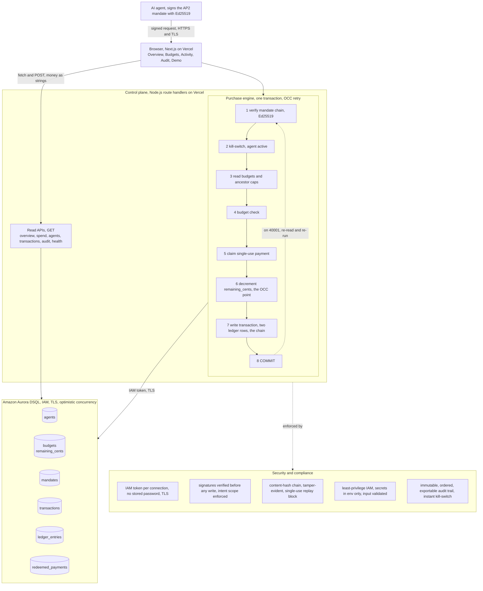

# Rein

A spending-control layer for AI agents, built on Amazon Aurora DSQL.

Companies are starting to let agents buy things on their own: renew subscriptions, pay APIs for data and inference, provision cloud capacity. Today an agent runs on a shared API key or a saved card with no limit, and finance learns what it bought when the invoice arrives. Rein gives every agent a corporate card with a real limit, checks every purchase against the budget and a signed authorization before money moves, and records each decision in a ledger that cannot be overspent under concurrent load.

## What it does

- Issues each agent a budget with limits per category and per period, and supports budget hierarchies so a team or org cap sits above its agents.
- Verifies a signed authorization (the AP2 Intent, Cart, Payment chain) on the server before any write, and rejects a tampered or out-of-scope mandate.
- Checks every purchase against the budget and the rules, then approves or blocks it, and records the specific reason for a block.
- Enforces single use, so one signed payment can be redeemed at most once.
- Provides an instant kill-switch that stops a revoked agent on its very next decision.
- Records every approved purchase in a double-entry ledger and keeps a tamper-evident audit trail.
- Shows live spend per agent and category, the activity feed, the audit chain, and a panel that runs each scenario through the real path.

## The idea that makes it work

The interesting problem is correctness under concurrency. A naive design inserts two ledger rows per purchase and then sums the ledger to check the budget. Under load this silently overspends: two purchases hitting the same budget at the same instant both read the current spend, both see room, both insert their own rows, and because those are different rows, nothing conflicts and both commit. The budget is blown, and it only breaks under load, which is the exact failure this product exists to prevent.

Rein routes the budget invariant through a single `remaining_cents` counter on the budget row and makes every purchase update that one row inside its transaction. Aurora DSQL uses optimistic concurrency control, so two purchases racing the same budget collide on that single row: the first commit wins, and the second fails at commit with a serialization error (SQLSTATE 40001). On 40001 the transaction re-reads the now-updated balance and re-decides, so the loser of a race is either correctly approved against the new balance or correctly blocked, never overspent. With budget hierarchies, a shared parent cap is the same single contended row, so agents under one team budget collide there too. This turns the overspend into the one anomaly the database provably catches, and it holds across regions with no two-phase commit and no lock service.

Money is stored as integer cents in `BIGINT` and handled as `BigInt` from read to write, so no balance ever passes through a floating-point value, and every API response converts it to a string at the boundary because a `BigInt` cannot be serialized to JSON.

## Architecture

Three layers, with all durable state in one place.

- Frontend: a Next.js App Router dashboard. Client components poll the read APIs on a short interval, so live spend and the activity feed update on their own. State lives in React, with no browser storage, so the app layer is stateless.
- Control plane: route handlers on the Node.js runtime. A purchase request arrives, the handler verifies the mandate chain, runs the budget and rule checks, claims the payment as single use, and commits the ledger transaction. The whole transaction is wrapped in an optimistic-concurrency retry.
- Ledger: Amazon Aurora DSQL. Strong consistency through optimistic concurrency, ACID, and it scales to zero between bursts.

Every database call runs on the Node.js runtime, never the Edge runtime, because a Postgres connection needs raw TCP. The connection authenticates with IAM through the official Aurora DSQL node-postgres connector, which mints a short-lived token per connection over TLS, so no database password is ever stored.



A higher-fidelity version of this diagram, with the full security and compliance posture, is at [`public/architecture.html`](public/architecture.html), served live at `/architecture.html`.

## The mandate chain

Each purchase is authorized by three signed objects, the AP2 Intent, Cart, and Payment mandates, each an Ed25519 signature over a strict canonical JSON form of its content. The chain is linked by content hashes: the cart references the hash of the intent, and the payment references the hashes of both, so changing any field after signing breaks the chain on verification. The server verifies the three signatures, the chain links, and the intent scope (amount cap, allowed categories and vendors, expiry) before any money moves, and the verified chain is persisted alongside the ledger entry so an approved purchase has a queryable, tamper-evident receipt.

## Data model

Aurora DSQL is its own database: no foreign keys, no triggers, UUID primary keys with `gen_random_uuid()`, and referential integrity enforced in the application. The schema lives in `migrations/`, one DDL statement per file.

- `agents` the principals that spend, with a status the kill-switch reads.
- `budgets` limit and `remaining_cents` per agent, period, and category, with an optional parent for hierarchies. `remaining_cents` is the concurrency control point.
- `mandates` the signed Intent, Cart, Payment chain, linked by `parent_mandate_id`, with the scope, content hash, and signature.
- `transactions` one row per decision, approved or blocked, with the specific reason.
- `ledger_entries` two balanced rows per approved transaction, one debit and one credit.
- `redeemed_payments` the payment content hash as a primary key, which enforces single use.

## Getting started

Requires Node 20 or newer and an Amazon Aurora DSQL cluster.

1. Install dependencies:

   ```bash
   npm install
   ```

2. Copy the environment template and fill in your values:

   ```bash
   cp .env.example .env.local
   ```

   Set `AWS_REGION`, `DSQL_CLUSTER_ENDPOINT`, and your AWS credentials. `.env.local` is gitignored.

3. Apply the schema to the cluster:

   ```bash
   npm run migrate
   ```

4. Confirm the connection end to end:

   ```bash
   npm run health
   ```

5. Load realistic demo data:

   ```bash
   npm run seed
   ```

6. Start the app:

   ```bash
   npm run dev
   ```

   Open `http://localhost:3000`. The health check is also exposed at `/api/health`.

## Testing

```bash
npm test
```

The suite runs against the live cluster, since there is no local emulator. It covers the purchase decisions, the mandate verification and tamper detection, the single-use and kill-switch gates, the money boundary, and the dashboard rendering states. The headline test fires concurrent purchases that fit the budget alone but not together and asserts exactly one commits, the loser sees 40001, the books stay balanced, and the budget is never overspent. A load test drives many concurrent purchases against a budget that allows exactly K and asserts the final balance is exact.

## Deploying to Vercel

The frontend and the API deploy as one Vercel project. Apply the migrations to the cluster once from your machine first, since the build does not run them.

Set these environment variables in the Vercel project:

- `AWS_REGION` the cluster region, for example `us-east-1`.
- `DSQL_CLUSTER_ENDPOINT` the cluster endpoint host.
- `AWS_ACCESS_KEY_ID` and `AWS_SECRET_ACCESS_KEY` for an IAM identity allowed to connect.
- `AWS_SESSION_TOKEN` only if those credentials are temporary.

The identity needs only the permission to connect to the cluster, which is the `dsql:DbConnectAdmin` action for the admin user. The database and AWS packages are kept out of the bundle through `serverExternalPackages` in `next.config.ts`, so they run as plain Node modules in the function. After deploy, confirm the connection at `/api/health`.

## Project structure

- `app/` the routes and the dashboard pages.
- `app/api/` the control-plane route handlers, all on the Node.js runtime.
- `lib/` the connection module, the purchase transaction, the optimistic-concurrency retry, the canonical serializer, the Ed25519 signing and verification, the budget writer, and the read queries.
- `components/` the dashboard UI.
- `migrations/` the schema, one DDL statement per file.
- `scripts/` the migration runner, the health check, and the demo seed.
- `test/` the suite.

## Author

Dhruv Bhatt
